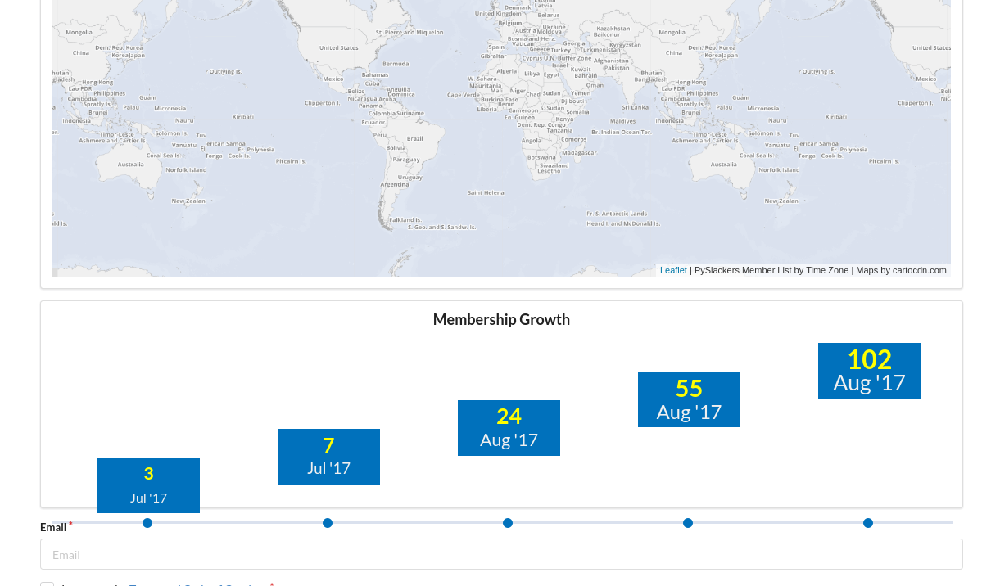

My attempt at satisfying [issue #49](https://github.com/pyslackers/website/issues/49) from the PySlackers Website.

My initial attempt resulted in a straight line w/ maybe a 40deg slope. The live data is simply too linear. This was my attempt to break away from the traditional line graph. Meh.

Script parses JSON to identify key dates to display. The font size increases from left to right.

